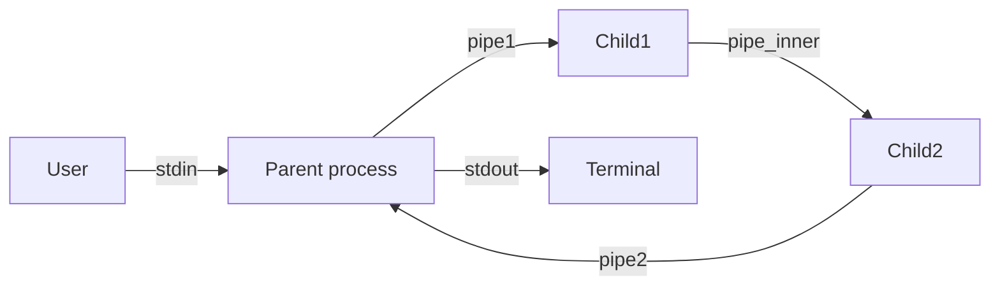

# Лабораторная работа №2

## Вариант 11 (Группа вариантов 3)

Родительский процесс создаёт два дочерних процесса (`child1` и `child2`). Родительский и дочерние процессы представлены отдельными скомпилированными программами.

Родительский процесс принимает от пользователя строки произвольной длины через стандартный поток ввода (`stdin`) и пересылает их в неименованный канал `pipe1`.

- **Процесс `child1`:** считывает данные из своего стандартного потока ввода (перенаправленного через `dup2` из `pipe1`), переводит символы в верхний регистр и выводит результат в свой стандартный поток вывода (перенаправленный через `dup2` в промежуточный канал `pipe_inner`).
- **Процесс `child2`:** считывает данные из своего стандартного потока ввода (перенаправленного через `dup2` из `pipe_inner`), заменяет пробельные символы (пробелы и знаки табуляции) на символ `_` и выводит результат в свой стандартный поток вывода (перенаправленный через `dup2` в канал `pipe2`).

Родительский процесс считывает итоговый результат из канала `pipe2` и выводит его в свой стандартный поток вывода (`stdout`).

Завершение ввода осуществляется по маркеру конца файла (`EOF`, комбинация клавиш `Ctrl+D` в терминале). После завершения ввода родитель закрывает дескриптор записи в `pipe1`, дочитывает оставшиеся в конвейере данные из `pipe2`, закрывает дескриптор чтения и ожидает завершения обоих дочерних процессов через системный вызов `waitpid()`.

## Взаимодействие процессов



## Сборка из корня проекта

```bash
cmake -S . -B build
cmake --build build
```

## Запуск

Переход в директорию сборки и интерактивный запуск:

```bash
cd build
./parent
```

Запуск с перенаправлением тестового файла:

```bash
./parent < ../data/in.txt
```

Тестовые файлы находятся в:

```
lab_02/data/
```